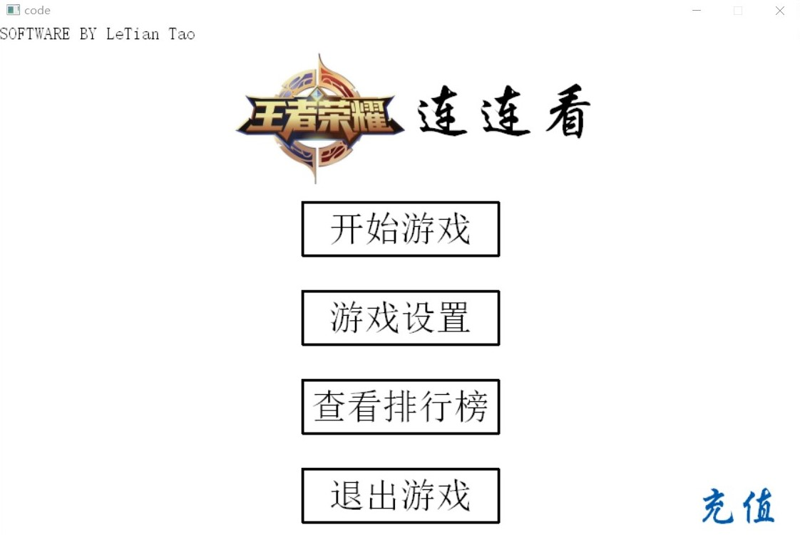
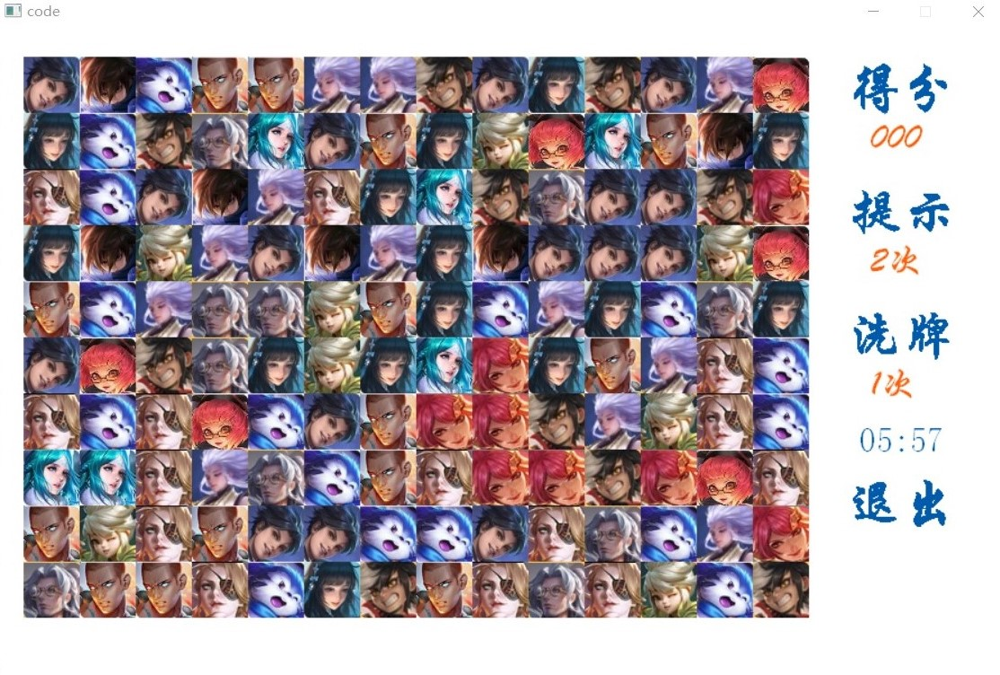
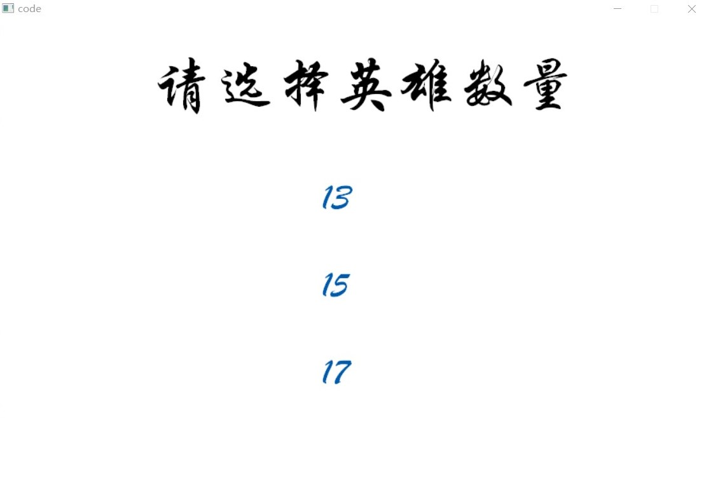
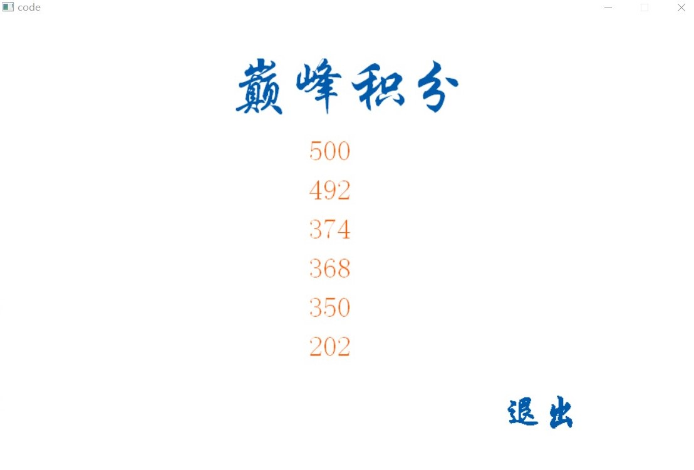

# 用户使用手册

## 1 基础功能

### 1.1 开启程序

点击王者荣耀连连看文件中的lianliankna.exe开启游戏，进入菜单界面。

### 1.2 开始游戏

在菜单界面中点击开始游戏，进入游戏界面如图下所示，左边游戏区域为练练看游戏，右边设置区域可以查看游戏分数和剩余游戏时间。具体说明如下：

1. 一次消除获得2分，相邻两次消除时间小于2s会有加倍得分；
2. 普通游戏玩家点击提示会消除一对图片，VIP玩家会消除多对；
3. 点击洗牌会对图片随机排序；
4. 点击退出返回到主界面。

### 1.3 游戏设置

在菜单界面点击游戏设计，进入游戏设置界面如下图所示，可选择游戏难度，即游戏人物数量，默认为13个英雄。对应地，游戏难度越高，连续消除的额外得分也越高。

### 1.4 游戏排名

在菜单界面点击游戏设计，进入游戏设置界面如图所示。

### 1.5 游戏充值

在菜单界面点击充值，游戏中基础得分100分，英雄获得全皮肤，点击提示有多对消除。再次点击退款可能回到普通模式。

## 2 扩展功能

用户可替换./fig文件夹中的图片，定制属于自己的练练看。注意图片总数和命名不能改变。